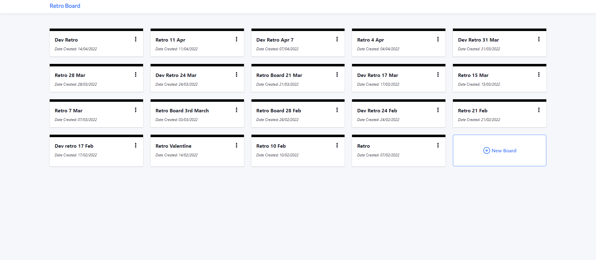

# Retro Board

Retro Board is awesome web application that provides a platform for keeping track of your retrospective meetings.




## Built With

* [Next.js](https://nextjs.org/)
* [Firebase](https://firebase.google.com/)
* [Chakra-UI](https://chakra-ui.com/)
* [Yarn](https://yarnpkg.com/)


# Getting Started

These instructions will get you a copy of the project up and running on your local machine for development and testing purposes. 


## Table of content

- [Installation](#installation)
- [Running on dev environment](#runningLocally)
- [Contribution](#contribution)
- [Deployment](#deployment)
- [Testing](#testing)


## Installation


1. Create an account at firebase [https://firebase.com]
2. Create a firebase project and make sure you setup firebase authentication and firestore
2. Clone the repo
   ```sh
   git clone git@github.com:PranishShresth/firebase-retro.git
   ```
3. Install NPM packages
   ```sh
   yarn install
   ```
4. Enter your API in `env.local` you get from your firebase console in this format
   ```js
    NEXT_PUBLIC_FIREBASE_API_KEY = ""
    NEXT_PUBLIC_FIREBASE_AUTH_DOMAIN = ""
    NEXT_PUBLIC_FIREBASE_PROJECT_ID = ""
    NEXT_PUBLIC_FIREBASE_STORAGE_BUCKET = ""
    NEXT_PUBLIC_FIREBASE_MESSAGING_SENDER_ID = ""
    NEXT_PUBLIC_FIREBASE_APP_ID = ""
    NEXT_PUBLIC_FIREBASE_MEASUREMENT_ID = ""
    ```
Make sure you properly setup firestore and firebase authentication on your firebase console.


## Running on dev environment

First, run the development server:

```bash
npm run dev
# or
yarn dev
```


## Contribution

If you have a suggestion that would make this better, please fork the repo and create a pull request.

1. Fork the Project
2. Create your Feature Branch (git checkout -b feature/AmazingFeature)
3. Commit your Changes (git commit -m 'Add some AmazingFeature')
4. Push to the Branch (git push origin feature/AmazingFeature)
5. Open a Pull Request


## Deployment

Currently the deployment is handled through the firebase hosting itself and is not automated. In future, it will automated on every merge to main branch.

## Testing
Currently not setup and is work in progress.
